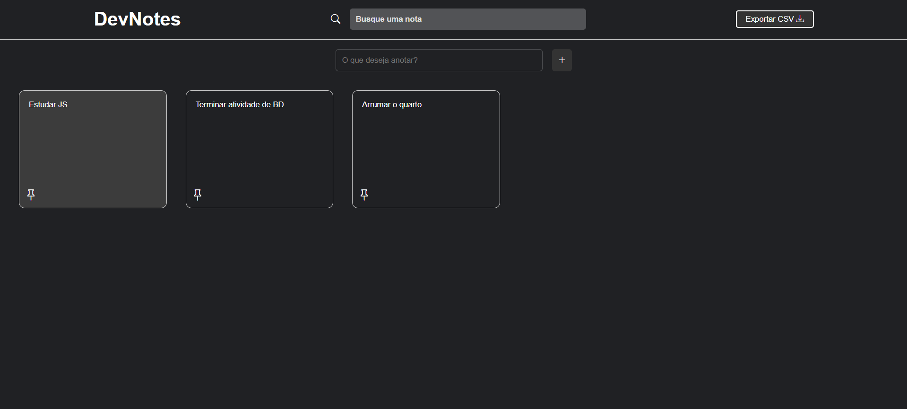

# 🗒️ DevNotes

Projeto **DevNotes** — uma aplicação web simples para criação, edição, fixação e remoção de anotações.  
Desenvolvido com **HTML**, **CSS** e **JavaScript**, como parte dos meus estudos em desenvolvimento front-end.

## 🚀 Funcionalidades

- ✅ Criar novas notas
- ✅ Fixar/desfixar notas importantes
- ✅ Remover notas
- ✅ Duplicar anotações
- ✅ Armazenamento local com `localStorage`
- ✅ Layout responsivo usando CSS Grid

## 🛠️ Tecnologias utilizadas

- **HTML5**
- **CSS3**
- **JavaScript (ES6)**
- Armazenamento com **localStorage**
- Manipulação de DOM
- `addEventListener`, `filter`, `find`, `sort`, `forEach`

## 📚 O que aprendi

- Prática com **JavaScript puro (Vanilla JS)** para manipular elementos na tela
- Organização de código em funções reutilizáveis
- Interação com o `localStorage` para salvar dados do usuário
- Estruturação visual com **CSS Grid** e responsividade
- Uso de boas práticas com eventos e ordenação de elementos

## 🎓 Contexto

Este projeto foi desenvolvido como parte de um curso de front-end. Embora eu tenha seguido a estrutura proposta pelo instrutor, adaptei partes do código e entendi na prática como aplicar **lógica de programação**, **controle de dados no navegador** e **organização visual com CSS**.

## 📷 Preview

## 🧑‍💻 Autor

**Eric Silva Pereira**  
[🔗 LinkedIn](https://www.linkedin.com/in/ericsilva001/)  
[💻 GitHub](https://github.com/EricSilvaPereira)
